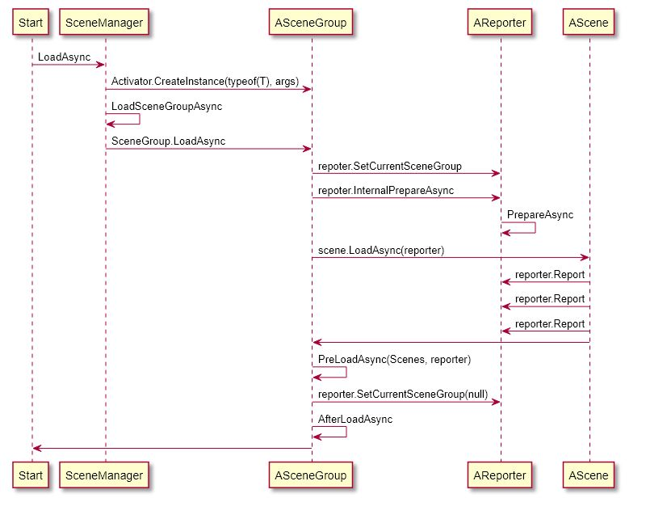

``` plantuml

Start -> SceneManager : LoadAsync
SceneManager -> ASceneGroup : Activator.CreateInstance(typeof(T), args)
SceneManager -> SceneManager : LoadSceneGroupAsync
SceneManager -> ASceneGroup : SceneGroup.LoadAsync
ASceneGroup -> AReporter : repoter.SetCurrentSceneGroup
ASceneGroup -> AReporter : repoter.InternalPrepareAsync
AReporter -> AReporter : PrepareAsync
ASceneGroup -> AScene : scene.LoadAsync(reporter)
AReporter <- AScene : reporter.Report
AReporter <- AScene : reporter.Report
AReporter <- AScene : reporter.Report
ASceneGroup  <- AScene
ASceneGroup -> ASceneGroup : PreLoadAsync(Scenes, reporter)
ASceneGroup -> AReporter : reporter.SetCurrentSceneGroup(null)
ASceneGroup -> ASceneGroup : AfterLoadAsync
Start <- ASceneGroup
```


